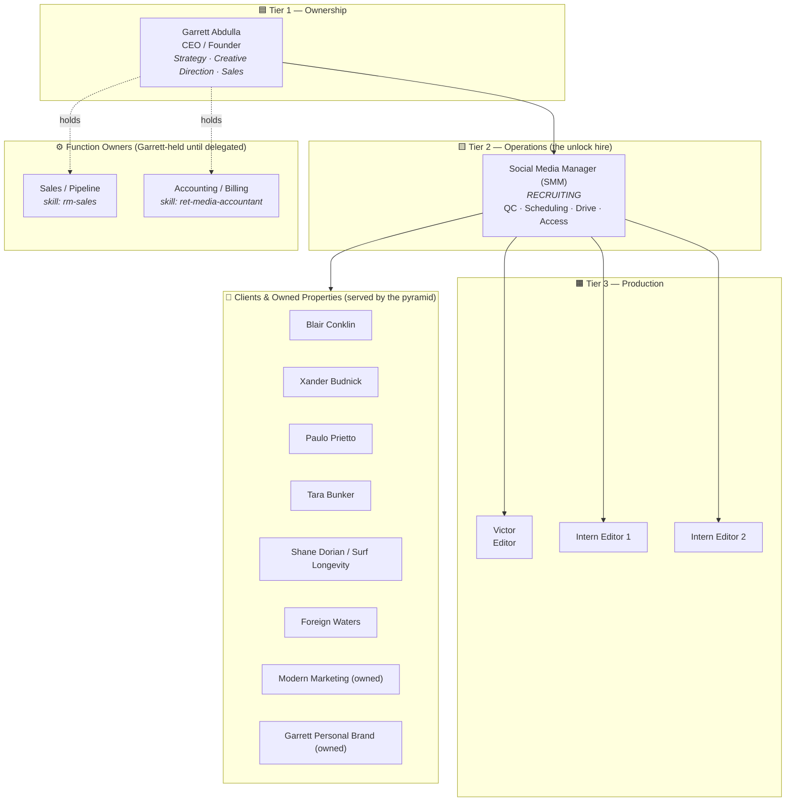
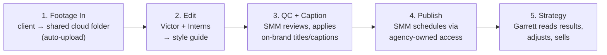

# RET Media LLC — Organizational Structure & Operating System

*System of record for how RET Media is staffed, how work flows, and how money moves.*
Last developed: **2026-08-13** · Owner: **Garrett Abdulla** · Entity: **RET MEDIA LLC** (NAICS 541613 — Marketing Consulting)

> **Grounding note.** This is not a wishlist. Every client, dollar, and role below is
> reconciled against live systems: **QuickBooks** (revenue, recurring billing, A/R),
> the **Notion CRM** (pipeline + tasks), the **90-Day Focus System** (strategy), and the
> **skill library** (each client/function has a codified SOP). Where a number is stated,
> its source is named.

---

## 0. The Operating Principle

Everything in this org exists so the founder holds only **two** jobs:

1. **Client strategy + creative direction** (what gets made, for whom, why it travels)
2. **Partnerships & sales** (new revenue, warm rooms, closing what's in motion)

Every other task must have (a) a named owner, (b) a written SOP (a *skill*), and
(c) a measurable "done." If a task can't be delegated, it's because its SOP doesn't
exist yet — so **the fix is always: write the skill, then hand it off.**

This is what makes the org robust: **roles are backed by runbooks, not by one person's memory.**

---

## 1. Org Chart

**Reporting lines**

| Person | Reports to | Directly manages |
|---|---|---|
| Garrett (CEO) | — (owner) | SMM; holds Sales + Accounting until delegated |
| Social Media Manager | Garrett | Victor + both Intern Editors |
| Victor (Editor) | SMM | — |
| Intern Editor 1 & 2 | SMM | — |

---

## 2. Roles & Scorecards

Each role is defined by **outcomes**, not hours. KPIs are the only things scored.

### Tier 1 — CEO / Founder · Garrett Abdulla
- **Owns:** final client strategy, deal structure, creative calls, partnerships & sales; final client-facing approval until SMM has earned trust.
- **Scorecard (weekly, from the 90-Day Focus System — only 3 numbers count):**
  1. Paying clients (count / MRR)
  2. Podcast guests booked → Ekko pipeline
  3. Ekko deliverables sold
- **Explicitly NOT doing:** editing, scheduling, captioning, file management, invoicing.

### Tier 2 — Social Media Manager (SMM) · *recruiting*
- **Comp path:** 6-month unpaid internship → **$800–1,200/mo** once trusted.
- **Reports to:** Garrett · **Manages:** all editors + interns.
- **Owns:** quality control on every video, RM Drive + folder structure, posting-plan
  spreadsheets, daily scheduling/publishing across all client accounts, access hygiene
  via the agency Business Portfolio (task-level permissions only).
- **Decision rights:** may approve & publish once trusted; until then Garrett retains
  final client-facing approval.
- **Scorecard:** on-time publishing cadence · zero lost files · QC pass rate (Garrett's
  spot-check) · team velocity (videos shipped/week) · access hygiene (0 personal-account dependencies).

### Tier 3 — Editor · Victor
- **Comp:** $400 through Sep 1 → **$800–1,000/mo** if the Xander deal closes.
- **Scope:** ~30 shorts + 1 midform / week for Xander Budnick Clips (trial target ~90 shorts + 3 midforms by Sep 1).
- **Reports to:** SMM.
- **Scorecard:** volume delivered on time · style-guide adherence · SMM QC pass rate (first-pass acceptance %).

### Tier 3 — Intern Editor 1 & 2
- **Comp:** **$300 per 30-video batch.**
- **Scope:** short-form cuts only; deliver into `RM/Intern` for SMM review.
- **Scorecard:** batch completion rate · quality after one SMM feedback loop.

### Function Owners (Garrett-held, delegate when revenue supports it)
- **Sales / Pipeline** — SOP: `rm-sales`. Prospecting, outreach, call prep, proposals, close, access handoff.
- **Accounting / Billing** — SOP: `ret-media-accountant`. QuickBooks invoicing, recurring billing, rev-share splits, contracts, collections.

---

## 3. Revenue Reality (QuickBooks, YTD 2026 — as of 2026-08-13)

**Total booked YTD: $30,511.87 across 6 billed customers.**

| Client | YTD Revenue | % of Total | Billing model | Source |
|---|---:|---:|---|---|
| **Blair Conklin** | $19,984.43 | **65.5%** | 35% revenue share (flows through RET) | QB Sales by Customer |
| Foresight 20/20 (Shane Dorian) | $5,000.00 | 16.4% | Project / invoiced | QB Sales by Customer |
| Paulo Prietto | $2,700.00 | 8.8% | **$900/mo recurring** (day 8) | QB Recurring + Sales |
| Foreign Waters | $1,500.00 | 4.9% | Per agreement | QB Sales by Customer |
| Tara Bunker | $1,299.00 | 4.3% | **$900/mo recurring** (restarts Sep 8) | QB Recurring + Sales |
| Nathan Florence | $28.44 | 0.1% | Trivial / one-off | QB Sales by Customer |

**Active recurring invoices (QuickBooks):** Paulo Prietto ($900/mo, next 2026-09-08) · Tara Bunker ($900/mo, starts 2026-09-08).
**A/R aging:** Paulo Prietto **$900 overdue (1–30 days)** → collection flag · Foresight 20/20 $2,500 current.
**Not yet in QuickBooks:** Xander Budnick (free 30-day trial, re-evaluated end of Aug — no invoice until the deal converts).

### ⚠️ The single biggest structural risk: client concentration
- **One client (Blair) = 65.5% of revenue. Top two = 82%.**
- If Blair pauses, ~two-thirds of cash disappears in a month.
- **Org implication:** the SMM hire and the sales function are not "nice to have" —
  they are the two levers that (a) free Garrett to sell and (b) diversify the base.
  **Target: no single client > 40% of revenue by EOY.**

---

## 4. The Four Revenue Engines

The org serves four distinct money engines. Each has an owner and a codified SOP.

| Engine | What it is | Primary owner | SOP (skill) |
|---|---|---|---|
| **1. Client retainers & rev-share** | Done-for-you social for creators/agents | SMM (delivery), Garrett (strategy) | per-client skills below |
| **2. Owned audience** | Modern Marketing (Skool, $997 Premium) + Garrett's personal brand | Garrett | `modern-marketing`, `garrett-pb` |
| **3. Ekko Archive (productized)** | 3-tier offer: Voice Map (free) → $799 Content Engine Report → $3,497 Blueprint | Garrett | 90-Day Focus System |
| **4. Yeah You podcast** | Sales engine → every outro/show-note = Voice Map CTA → Ekko pipeline | Garrett | 90-Day Focus System |

Engines 3 & 4 are the **diversification play** against the Blair concentration risk in §3.

---

## 5. Clients & Owned Properties — with built-in SOPs

Every account below already has a **dedicated skill = a documented, repeatable runbook.**
This is why the org is delegable: onboarding a new SMM/editor = "run the skill."

| Account | Type | Status | Deliverables | Terms | SOP (skill) |
|---|---|---|---|---|---|
| **Blair Conklin** | Client | Active | ~60 TikToks/mo + FB Reels, Skid Kids captions | 35% rev share | `blair-conklin`, `blair-tiktok-monthly`, `fb-reels-uploader`, `blair-video-distributor` |
| **Xander Budnick** | Client | Trial · re-eval end Aug | 5 shorts/day + midforms + TikTok/FB redistribution | Free 30 days → convert | `xander-clips` |
| **Paulo Prietto** | Client | Active | 2–3 real-estate posts/wk (IG) | $900/mo | `paulo-prietto` + `real-estate-social-manager` |
| **Tara Bunker** | Client | Restarts Sep 1 | IG management (Compass / ALCOVE) | $900/mo | `tara-bunker` + `real-estate-social-manager` |
| **Shane Dorian** | Client | Active | Surf Longevity — Skool course, brand, scripts | via Foresight 20/20 | `shane-dorian` |
| **Foreign Waters** | Client | Active | Energy Flow brand content from Gianni footage | Per agreement | `foreign-waters` |
| **Modern Marketing** | Owned | Active | Skool community (Premium $997/mo) | Own | `modern-marketing` |
| **Garrett Personal Brand** | Owned | Active | Proof-first content → funnel | Own | `garrett-pb` |

**Cross-cutting functional skills:** `rm-sales` (pipeline), `ret-media-accountant` (billing), `real-estate-social-manager` (design/caption/compliance system shared by Paulo + Tara).

---

## 6. The Canonical Production Pipeline (with RACI)

**RACI** — *R*esponsible · *A*ccountable · *C*onsulted · *I*nformed

| Step | Garrett | SMM | Editors/Interns | Client |
|---|:--:|:--:|:--:|:--:|
| Footage intake | I | A | I | R |
| Edit to style guide | C | A | R | I |
| QC + caption | C* | R/A | I | I |
| Schedule + publish | C* | R/A | — | I |
| Performance review + strategy | R/A | C | I | I |
| Billing / rev-share | A | I | — | I |

\* Garrett's consult on QC/publish drops away once the SMM has earned publishing trust.
**Escalation path:** SMM → Garrett **only** for creative/strategic decisions or client
complaints. Everything else stays inside Tier 2–3.

---

## 7. CRM & Pipeline (Notion — the gamified layer)

RET runs a real CRM, not a spreadsheet of hope.

**`Ret Media CRM Prospects and Tasks Tracker`** (Notion database)
- **Pipeline stages:** New → Contacted → Follow-up needed → Negotiation → **Won / Lost**
- **Fields:** Deal (value/scope), Interested services, Won services, Next follow-up (never empty), Notes (Date — action — outcome — next step)
- **Linked Tasks Tracker:** every prospect → tasks with Assignee, Due date, Priority, Status.

**`90-Day Focus System`** — the gamified operating cadence (the "keystone" discipline):
- **Three lanes only:** Ekko (finish the offer) · Podcast (sales engine) · Money hygiene.
- **Weekly scorecard — only 3 numbers count:** paying clients · guests booked · Ekko deliverables sold. *Not impressions, not emails sent.*
- **Parking Lot rule:** new ideas wait 90 days before earning a slot (kills shiny-object churn).
- **Paused list:** explicit "do not touch" backlog so focus stays on what's in motion.

> **Org meaning:** the CRM is the sales function's system of record (owner: `rm-sales`),
> and the 90-Day scorecard is the CEO's personal accountability layer. Sales feeds the
> pipeline; the pyramid delivers what sales closes; accounting bills it.

---

## 8. Access, Infrastructure & Tooling (must-fix before full delegation)

Delegation is blocked until access lives with the **company**, not Garrett's personal logins.

1. **Account access** — move everything off Garrett's personal Gmail into a **Meta Business
   Portfolio owned by `info@retmediaagency.com`**, with YouTube manager invites to the same.
   Grant SMM **task-level (not admin)** permissions.
2. **Scheduling layer** — trial Metricool or Vista Social for IG/FB retainers; keep monetized
   TikTok/YT native.
3. **Footage intake** — one shared cloud folder per client with mobile auto-upload
   (mirror Xander's Google Photos model for everyone).
4. **Systems of record** — QuickBooks (money) · Notion CRM (pipeline + tasks) · Google Drive
   `RM/` (assets + posting plans) · skill library (SOPs).

---

## 9. Cost & Financial Guardrails

**Current monthly team cost**

| Line | Cost | Notes |
|---|---:|---|
| Victor (Editor) | $400 (→ $800–1,000 if Xander closes) | through Sep 1 |
| Intern Editor 1 | $300 / 30-video batch | variable |
| Intern Editor 2 | $300 / 30-video batch | variable |
| SMM | $0 now → $800–1,200/mo | unpaid internship first |
| **Run-rate through Sep 1** | **~$1,000** | before SMM/Xander conversions |

**Contracted recurring revenue (QuickBooks):** Paulo $900/mo + Tara $900/mo (from Sep) = **$1,800/mo** floor, plus Blair 35% rev-share (variable, the largest line) and Shane/Foreign Waters project work.

**Guardrails**
- **Monthly floor first:** rent + bills + food number is what the business must clear before anything is "profit" (per 90-Day money-hygiene lane).
- **Concentration ceiling:** no single client > 40% of revenue by EOY (today Blair = 65.5%).
- **Collections cadence:** any A/R > 30 days triggers a `ret-media-accountant` reminder (currently: Paulo $900).
- **Every new hire must be paid from *new contracted MRR*, not from the rev-share swing line.**

---

## 10. Hiring & Scaling Roadmap

| Phase | Trigger | Hire / Move | Why |
|---|---|---|---|
| **Now** | Recruiting | Social Media Manager (intern→paid) | The unlock: removes QC/scheduling/access from Garrett |
| **On Xander close** | Deal converts | Victor → full editor comp; possibly a 2nd editor | Volume (5 shorts/day) needs capacity |
| **At ~$5–6k stable MRR** | Retainers cover it | Client Success / Account Coordinator | Owns client comms + reporting, protects retention |
| **Later** | Ekko revenue proven | Ekko delivery specialist | Scales engine 3 without Garrett doing every report |

**Ramp standard:** any new hire should reach productivity in **< 48 hours** by running the
relevant skill(s) — that's the payoff of SOP-per-role.

---

## 11. Robustness Additions (what makes this an *operating system*, not a chart)

- **Role scorecards** — one page per role, 3–5 measurable KPIs + "definition of done" (§2).
- **RACI matrix** — for the production pipeline (§6); extend to intake, reporting, access.
- **Style-guide library** — living docs per niche (Skid Kids caption bank, Xander format, real-estate compliance) referenced by the skills.
- **SOP-per-role** — every client & function has a skill; onboarding = "run the skill."
- **Single escalation path** — SMM → Garrett only for creative/strategy/complaints.
- **Financial guardrails** — concentration ceiling, collections cadence, pay-from-new-MRR rule (§9).
- **Gamified accountability** — 90-Day 3-number scorecard + Parking Lot to kill shiny-object churn (§7).

---

## 12. Top Risks → Mitigations

| Risk | Severity | Mitigation | Owner |
|---|:--:|---|---|
| Blair = 66% of revenue | 🔴 High | Land 2–3 retainers; grow Ekko/podcast engines; 40% ceiling | Garrett + Sales |
| Access lives on Garrett's personal Gmail | 🔴 High | Migrate to Business Portfolio under `info@retmediaagency.com` | Garrett → SMM |
| No SMM = Garrett is the bottleneck | 🟠 Med | Close the SMM hire; trusted publishing rights | Garrett |
| Xander trial doesn't convert | 🟠 Med | Editor comp is contingent; re-eval end Aug; don't overhire ahead | Garrett |
| A/R slippage (Paulo $900) | 🟡 Low | 30-day collections cadence via accountant skill | Accounting |
| Shiny-object churn | 🟡 Low | Parking Lot + Paused list in 90-Day system | Garrett |

---

*This document is the living org spec. Update it whenever the QuickBooks roster, the Notion
pipeline, or the team changes — it is designed to be re-derived from those same sources.*
